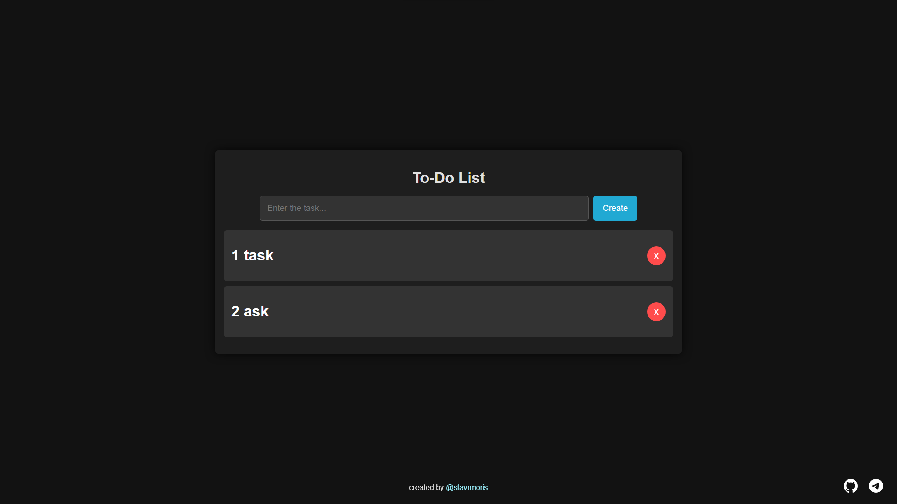

# 📝 To-Do List App

## Overview

This is a simple, browser-based **To-Do List App** created for educational purposes. It allows you to add, display, and remove tasks, with persistent data stored in the browser's `localStorage`. Each task can be removed with a smooth animation, ensuring an elegant user experience.

## Features

- **Add tasks**: Input new tasks using the input field and click the "Add" button.
- **Remove tasks**: Delete tasks by clicking the "x" button next to the task.
- **Animations**: Tasks fade in when added and shrink before they are deleted.
- **Persistent data**: Tasks are saved in `localStorage` so they remain even after refreshing the page.
